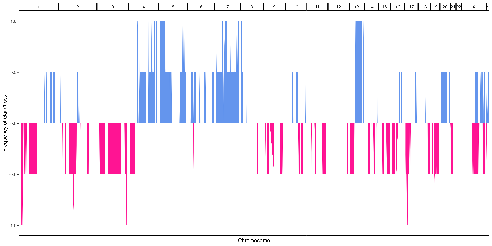
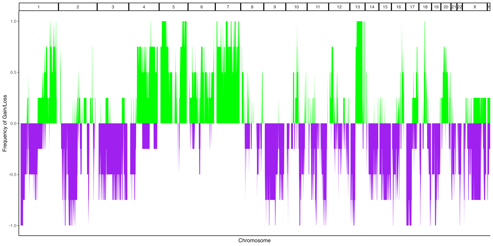
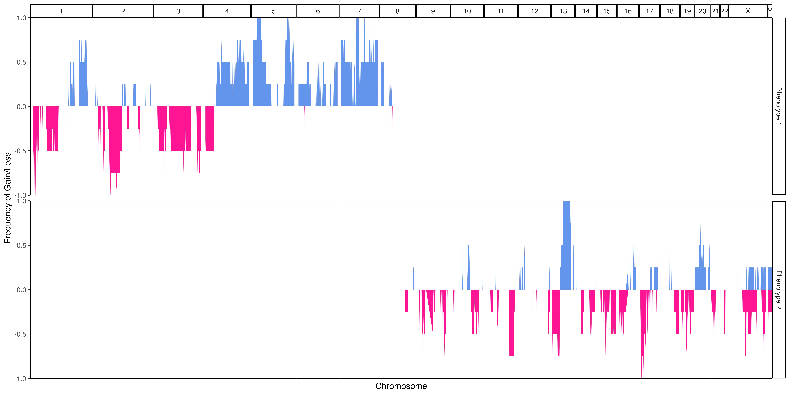
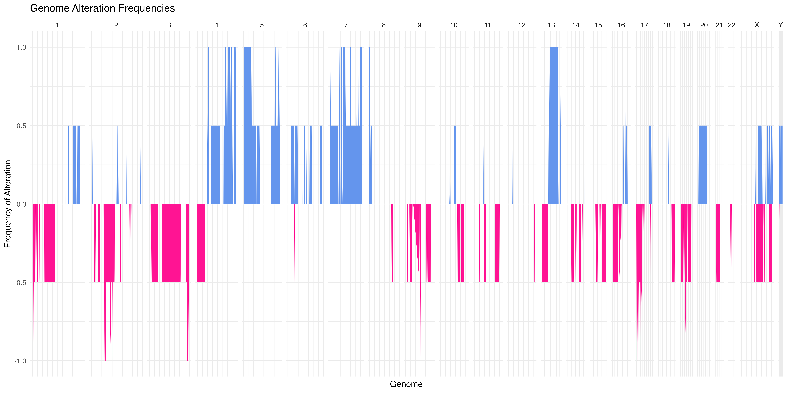

```{r, include = FALSE}
knitr::opts_chunk$set(
  collapse = TRUE,
  comment = "#>"
)
devtools::load_all(".")
```

Frequency plots are commonly used in copy number analysis in bulk sequencing
studies to show how frequently different regions of the genome are altered. A
similar approach can be done in single cell data by pseudobulking the cells and
then thresholding the values to label each region as a loss or gain for the
pseudobulked values.

By default, the `makeFrequencyPlot()` function will take group all cells based
on their sample of origin (or whatever metadata column is provided to the `group`
parameter) and take the mean copy number value for that group at each genomic bin.
It will then perform thresholding to label regions as loss/neutral/gain. As a primary
example, we can begin with the example data and use the default values for the function.

```{r setup}
library(SCCNVis)

obj <- SCCNVis::createPlotObject(example.matrix,
                                 example.cells,
                                 example.granges,
                                 example.meta)
fp.result <- SCCNVis::makeFrequencyPlot(obj)

#SCCNVis::saveCustomPlot(fp.result, "~/path/to/plot.png")
```
```{r echo=FALSE, fig.cap="Example 1a. Frequency Plot", out.width = '100%'}

```

As with standard frequency plots, colored regions above 0 indicate that a percentage
of our pseudobulked samples have gains in those regions, while colored regions below
0 indicate that a percentage of our pseudbulked samples have losses in those regions.
Since our example only has 2 samples, you can see that all values are 0%, 50%, or 100%.

While the default above is the standard use for a frequency plot, `makeFrequencyPlot()`
includes some additional features that may help provide additional insights. For example,
the pseudobulked values do not necessarily have to represent samples. In the below example,
they represent subclones identified through clustering (see Heatmap example). The below
example also shows how users can provide custom filtering thresholds to define gains and losses
and how to color those values with custom colors.

```{r}
#Calculate distance matrix values
dist <- parallelDist::parallelDist(obj@Matrix)
#Perform hierarchical clustering
hc_re <- hclust(dist, method="ward.D2")
#Dynamically assign clusters
dynamic.kclusters <- dynamicTreeCut::cutreeDynamic(dendro = hc_re, 
                                                   distM = as.matrix(dist),
                                                   deepSplit = 0,
                                                   pamRespectsDendro = TRUE
                                                   )
names(dynamic.kclusters) <- hc_re$labels
obj <- SCCNVis::addMetaData(obj, dynamic.kclusters, colname = "DynamicKClusters")


#Defining a custom thresholding function
#The function will be passed a data.frame with the following format
#Columns: "chrm" "middle" "pos.index" "name" "value" 
#Where chrm = seqname from obj@GRanges
#      middle = Middle of genomic position (bp)
#      pos.index = Numerical index of row
#      name = Name of sample (or other pseudobulked group)
#      value = Copy number value for the pseudobulked group for this region
#The output of the function is expected to be the a data frame
#that includes these same columns, although this is explored
#further in a later example
custom.data.func <- function(data) {
      sd.value <- sd(data$value, na.rm = TRUE)
      mean.value <- mean(data$value, na.rm = TRUE)
      #Any value > mean + 0.5sd will be considered a gain
      data[data$value > mean.value + (sd.value * 0.5),"value"] <- 2 #Gain == 2
      #Any value < mean - 0.5sd will be considered a loss
      data[data$value < mean.value - (sd.value * 0.5),"value"] <- 0 #Loss == 0
      #All other values will be considered neutral
      data[data$value != 2 & data$value != 0,"value"] <- 1 #Neutral == 1
      return(data)
    }

fp.result <- SCCNVis::makeFrequencyPlot(obj,
                                        group = "DynamicKClusters",
                                        data.func = custom.data.func,
                                        gain.color = "green",
                                        loss.color = "purple")

#SCCNVis::saveCustomPlot(fp.result, "~/path/to/plot.png")
```
```{r echo=FALSE, fig.cap="Example 1b. Frequency Plot, pseudobulked subclones", out.width = '100%'}

```

As you can see, with our 4 subclones and looser thresholding criteria, we now see
greater variety in our frequency plot.

Together with the `secondary.group` parameter, we can also use the `data.func` to
introducing a secondary grouping to our data. This is done by adding a new column
to the data.frame during the `data.func` modification and providing the name of that
new column to the `secondary.group`. In this case, we will change our `custom.data.func`
to use a threshold of 1sd (the same as the default function used by `makeFrequencyPlot()`),
but we will label the first half of the data as "Phenotype 1" and the second half
as "Phenotype 2". This is an arbitrary example, but if you have real phenotypic
(or other data) that can be mapped to the 'name' column of the data passed to the `data.func`,
you could supply that instead.

Note that in our `custom.data.func` below, the input data is sorted by genomic region,
so by assigning the first half of the data frame to "Phenotype 1", we expect that
all copy number alterations in Phenotype 1 will be limited to the first half of the genome,
while Phenotype 2 will only have alterations in the second half of the genome.

```{r}

#Custom data function that defines thresholds as mean +/- 1sd
#Also adds arbitrary phenotype data
custom.data.func <- function(data) {
      sd.value <- sd(data$value, na.rm = TRUE)
      mean.value <- mean(data$value, na.rm = TRUE)
      #Any value > mean + 1sd will be considered a gain
      data[data$value > mean.value + sd.value,"value"] <- 2 #Gain == 2
      #Any value < mean - 1sd will be considered a loss
      data[data$value < mean.value - sd.value,"value"] <- 0 #Loss == 0
      #All other values will be considered neutral
      data[data$value != 2 & data$value != 0,"value"] <- 1 #Neutral == 1
      
      #Add arbitrary phenotypic data
      total_rows = nrow(data)
      midpoint = round(total_rows * 0.5)
      data[1:midpoint,"Phenotype"] <- "Phenotype 1"
      data[midpoint:total_rows,"Phenotype"] <- "Phenotype 2"
      return(data)
    }

#Again, using the DynamicKClusters metadata added previously
fp.result <- SCCNVis::makeFrequencyPlot(obj,
                                        group = "DynamicKClusters",
                                        secondary.group = "Phenotype",
                                        data.func = custom.data.func)

#SCCNVis::saveCustomPlot(fp.result, "~/path/to/plot.png")
```
```{r echo=FALSE, fig.cap="Example 1c. Frequency Plot, pseudobulked subclones grouped by arbitrary phenotype", out.width = '100%'}

```

Finally, like the `makeLinePlot()` function, the output plot is a ggplot object,
which means that users can freely alter the output like they would a standard ggplot
figure. Additionaly, `fp.result$PlotData` contains the data.frame used to generate
the plot, so users can create the plot from scratch if they desired. An example of
this customization is shown below.

```{r}

fp.result <- SCCNVis::makeFrequencyPlot(obj)

final.plot <- fp.result$Plot +
  ggplot2::geom_hline(yintercept = 0, color='black') +
  ggplot2::labs(x="Genome",
                y="Frequency of Alteration",
                title="Genome Alteration Frequencies") +
  ggplot2::theme_minimal() +
  ggplot2::theme(axis.text.x = ggplot2::element_blank(),
                     axis.ticks.x = ggplot2::element_blank())

#fp.result$Plot <- final.plot
#SCCNVis::saveCustomPlot(fp.result, "~/path/to/plot.png")
```
```{r echo=FALSE, fig.cap="Example 1d. Frequency Plot with customization", out.width = '100%'}

```
