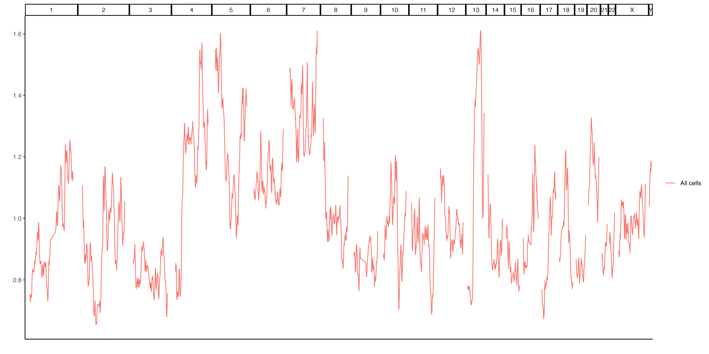
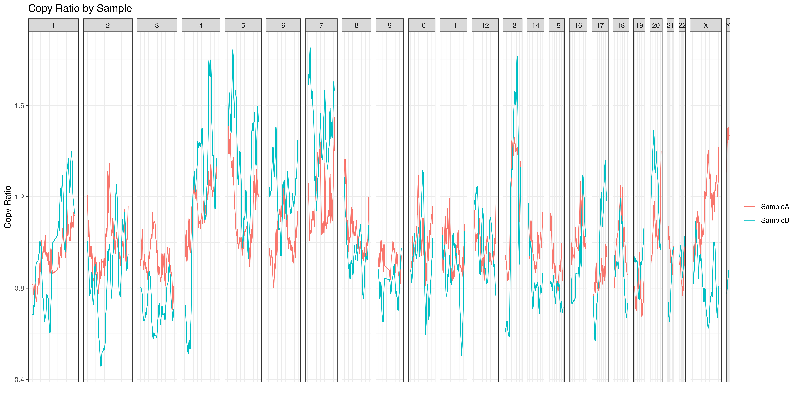
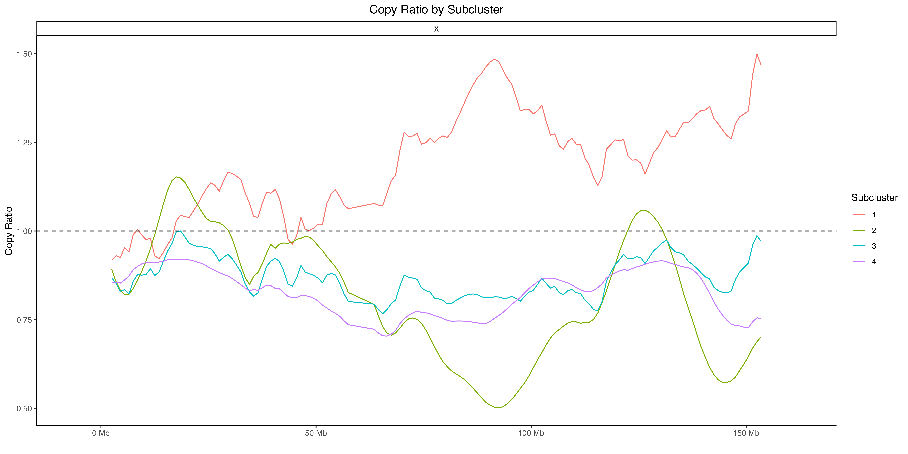

```{r, include = FALSE}
knitr::opts_chunk$set(
  collapse = TRUE,
  comment = "#>"
)
devtools::load_all(".")
```

Although heatmaps are one of the most common ways to visualize single-cell copy
number results, the combination of large genomes, small genomic bins and drastic
genomic alterations can make it difficult to observe subtle differences.

A simple line plot can be an easy to way to quickly visualize different regions of the genome and visualize the differences in specific regions. SCCNVis provides a simple line plot method that returns a ggplot2 object, which can be easily customized to fit the user's exact needs. We begin with the example data provided (see the Heatmaps
example for an intro to this data):

```{r setup}
library(SCCNVis)

obj <- SCCNVis::createPlotObject(example.matrix,
                                 example.cells,
                                 example.granges,
                                 example.meta)
lineplot.result <- SCCNVis::makeLinePlot(obj)
print(names(lineplot.result))
```


The output from `makeLinePlot` is an object with two items. `Plot` is a ggplot2
plot that can be further customized as desired. `PlotData` is the data used to
create the plot, in case the user wants to create their own visualization.

Similar to the `SCCNVis::makeSCHeatmap()` function, the outputs of the line plot
function can be saved using the provided helper function, or using any other
method commonly used to save ggplot outputs, such as `ggsave`.

```{r eval=FALSE}
#Example manual method
#ggplot2::ggsave("~/path/to/lineplot.png", lineplot.result$Plot)

#Simple wrapper for convenience
SCCNVis::saveCustomPlot(lineplot.result, "/path/to/heatmap.png")
```
```{r echo=FALSE, fig.cap="Example 1a. Lineplot", out.width = '100%'}

```

Lineplots may be grouped by any column in the SCCNVis object's metadata. The
function also provides various other ways to customize the plot. Below is
an example of how this can be done using the `Sample` column, and how the 
output object can be further customized to the user's preferences:

```{r}

group.colors <- c("Blue","Red")
names(group.colors) <- c("SampleA","SampleB")

lineplot.result <- SCCNVis::makeLinePlot(obj,
                                        group = "Sample",
                                        group.colors = group.colors
                                        )
final.plot <- lineplot.result$Plot +
  ggplot2::labs(y="Copy Ratio",
                title="Copy Ratio by Sample") +
  ggplot2::theme_bw() +
  ggplot2::theme(axis.text.x = ggplot2::element_blank(),
                       axis.ticks.x = ggplot2::element_blank())

#Save using ggsave, because the final plot is not the one
#in heatmap.results
#ggplot2::ggsave("~/path/to/lineplot.png", final.plot)

```
```{r echo=FALSE, fig.cap="Example 1b. Lineplot grouped by sample", out.width = '100%'}

```

Of course, other metadata can be used as well. Here, we perform the same
clustering using in the Heatmap example and plot each group and plot the resulting
clusters. Because our earlier line plot shows great variability on chrX,
we could choose to limit our plot to that chromosome. Again, we may choose
to add additional customizations to the output plot.

```{r}
#Calculate distance matrix values
dist <- parallelDist::parallelDist(obj@Matrix)
#Perform hierarchical clustering
hc_re <- hclust(dist, method="ward.D2")
#Dynamic clustering
dynamic.kclusters <- dynamicTreeCut::cutreeDynamic(dendro = hc_re, 
                                                   distM = as.matrix(dist),
                                                   deepSplit = 0,
                                                   pamRespectsDendro = TRUE
                                                   )
names(dynamic.kclusters) <- hc_re$labels
obj <- SCCNVis::addMetaData(obj, dynamic.kclusters, colname = "DynamicKClusters")

#Using the example.granges object that the SCCNVis object was created from
plot.regions <- example.granges[example.granges@seqnames == "chrX",]

lineplot.result <- SCCNVis::makeLinePlot(obj,
                                        gr = plot.regions,
                                        group = "DynamicKClusters",
                                        ylab = "Copy Ratio",
                                        show.x.ticks = TRUE
                                        )
final.plot <- lineplot.result$Plot +
  ggplot2::geom_hline(yintercept = 1, linetype="dashed", color="black") +
  ggplot2::labs(title="Copy Ratio by Subcluster",
                color="Subcluster") +
  ggplot2::theme(plot.title = ggplot2::element_text(hjust = 0.5))

#Rather than use ggsave, here I opt to add the updated
#plot to the lineplot.result object and then use the wrapper function
#lineplot.result$Plot <- final.plot
#SCCNVis::saveCustomPlot(lineplot.result, "~/path/to/lineplot.png")

```
```{r echo=FALSE, fig.cap="Example 1c. Lineplot with subclusters", out.width = '100%'}

```
