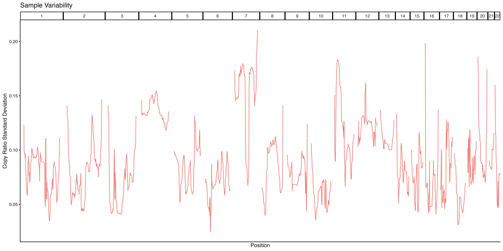

```{r, include = FALSE}
knitr::opts_chunk$set(
  collapse = TRUE,
  comment = "#>"
)
devtools::load_all(".")
```

Although heatmaps are one of the most common ways to visualize single-cell copy
number results, the combination of large genomes, small genomic bins and drastic
genomic alterations can make it difficult to observe subtle differences.

A simple line plot can be an easy to way to quickly visualize different regions of the genome and visualize the differences in specific regions. scCNVis provides a simple line plot method that returns a ggplot2 object, which can be easily customized to fit the user's exact needs. We begin with the example data provided:

```{r setup}
library(scCNVis)

obj <- scCNVis::createPlotObject(example.matrix,
                                 example.cells,
                                 example.granges,
                                 example.meta)
lineplot.result <- scCNVis::makeLinePlot(obj)
print(names(lineplot.result))
```
```{r echo=FALSE, fig.cap="Example 1a. Lineplot", out.width = '100%'}
knitr::include_graphics("1a_lineplot.png")
```

The output from `makeLinePlot` is an object with two items. `Plot` is a ggplot2
plot that can be further customized as desired. `PlotData` is the data used to
create the plot, in case the user wants to create their own visualization.

The outputs of the line plot
function can be saved using the provided helper function, or using any other
method commonly used to save ggplot outputs, such as `ggplot2::ggsave(lineplot.result$Plot)`.

Lineplots may be grouped by any column in the scCNVis object's metadata. The
function also provides various other ways to customize the plot. Below is
an example of how this can be done using the `Subclone` column available
in our example data, and how the output object can be further customized to the
user's preferences:

```{r}

group.colors <- c("Blue","Red","Yellow","Green") #We have 4 subclones
names(group.colors) <- unique(obj@Meta$Subclone)

lineplot.result <- scCNVis::makeLinePlot(obj,
                                        group = "Subclone",
                                        group.colors = group.colors
                                        )
final.plot <- lineplot.result$Plot +
  ggplot2::labs(y="Copy Ratio",
                title="Copy Ratio by Subclone") +
  ggplot2::theme_bw() +
  ggplot2::theme(axis.text.x = ggplot2::element_blank(),
                       axis.ticks.x = ggplot2::element_blank())

#Save using ggsave, because the final plot is not the one
#in heatmap.results
#ggplot2::ggsave("~/path/to/lineplot.png", final.plot)

```
```{r echo=FALSE, fig.cap="Example 1b. Lineplot grouped by sample", out.width = '100%'}
knitr::include_graphics("1b_lineplot.png")
```

Of course, other metadata can be used as well. Here, we perform the same
clustering used in the Heatmap example and plot the resulting
clusters. Because our earlier line plot shows great variability on chrX,
we could choose to limit our plot to that chromosome. Again, we may choose
to add additional customizations to the output plot.

```{r}

#Using the example.granges object that the scCNVis object was created from
plot.regions <- example.granges[example.granges@seqnames == "chr4" | example.granges@seqnames == "chr7",]

lineplot.result <- scCNVis::makeLinePlot(obj,
                                        gr = plot.regions,
                                        group = "Subclone",
                                        ylab = "Copy Ratio",
                                        show.x.ticks = TRUE
                                        )
final.plot <- lineplot.result$Plot +
  ggplot2::geom_hline(yintercept = 1, linetype="dashed", color="black") +
  ggplot2::labs(title="Copy Ratio by Subcluster",
                color="Subcluster") +
  ggplot2::theme(plot.title = ggplot2::element_text(hjust = 0.5))

#Rather than use ggsave, here I opt to add the updated
#plot to the lineplot.result object and then use the wrapper function
#lineplot.result$Plot <- final.plot
#scCNVis::saveCustomPlot(lineplot.result, "~/path/to/lineplot.png")

```
```{r echo=FALSE, fig.cap="Example 1c. Lineplot with subclusters", out.width = '100%'}
knitr::include_graphics("1c_lineplot.png")
```

Finally, `makeLinePlot` supports alternative metrics that may provide new insights
using the `method` parameter. By default, `method = mean` and the line plot shows
the average value in each genomic bin for each group. Using `method = median` provides a 
similar approach. However, `method = range` reports the range (max - minimum) for
a group, showing the heterogeneity within the group and `method = sd` measures
the standard deviation. In this case, the height of the line on the y-axis is measuring
how much variability exists in that region. Since our previous plot showed large
differences between subclones on chr4 and chr7, we might expect those regions
to be some of the highest points on this plot.

```{r}

lineplot.result <- scCNVis::makeLinePlot(obj,
                                         method = "sd")

#Customize as desired
final.plot <- lineplot.result$Plot +
  ggplot2::labs(x="Position",
                y="Copy Ratio Standard Deviation",
                title="Sample Variability") +
  ggplot2::theme(legend.position="none")

```
```{r echo=FALSE, fig.cap="Example 1d. Lineplot ranges", out.width = '100%'}

```

As expected, we see relatively high standard deviation scores on chr4 and chr7,
suggesting that this sample has CN heterogeneity in those regions.